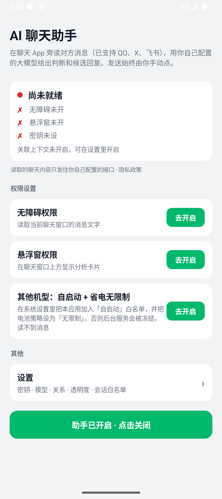
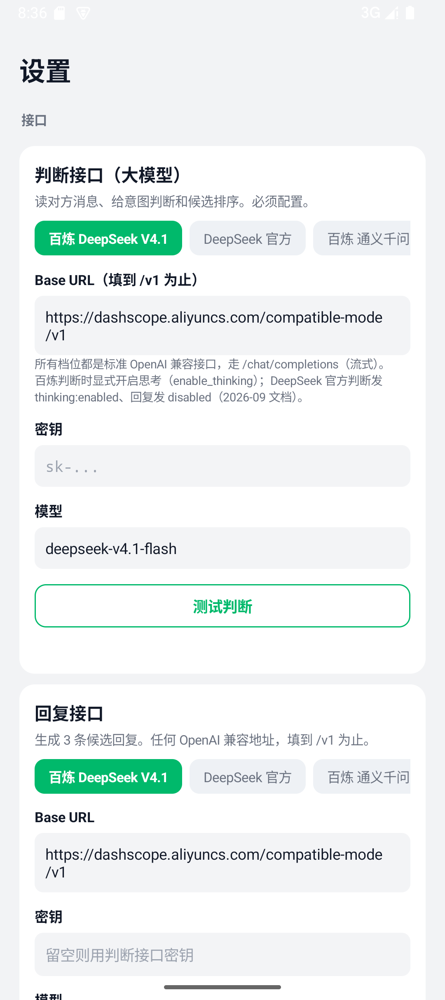
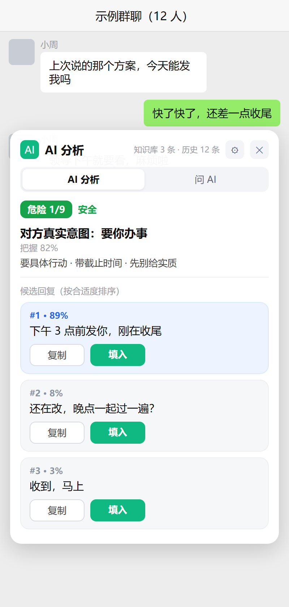
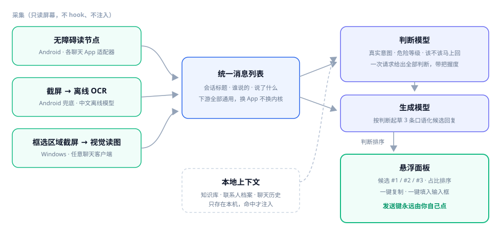

<div align="center">

# AIChat · AI 聊天助手（Android）

**装在手机上的「对话副驾」：你在任何聊天 App 里聊天，它在旁边读懂对方、告诉你该怎么回，一键填进输入框，发不发由你。**

[](https://github.com/ChencLi819/aichat-android/actions/workflows/ci.yml)
[](#快速开始)
[](#快速开始)
[](LICENSE)

姊妹仓库：[aichat-windows](https://github.com/ChencLi819/aichat-windows)（Windows 版）

</div>

## 页面展示

| 主页 · 就绪向导 | 设置 · 三路接口 |
|---|---|
|  |  |

**悬浮分析面板**（分析结果视图，页面原型示意）：



## 工作链路（概念图）



## 为什么用它

- **它先判断，再写字。** 判断模型先给出对方真实意图、危险等级、该不该马上回，再据此起草回复。
- **不动你的聊天软件。** 不 hook、不改包、不走任何 App 的接口或账号、不读数据库，只用系统无障碍服务读「屏幕上正在显示的对话」。
- **发送权永远在你手里。** 程序只把回复填进输入框，从不自动发送，不碰转账 / 红包 / 收款。
- **一套内核，多端适配。** 一个 App 一个适配器，新增一个聊天 App 只需写一个几十行的适配器。
- **它认识你的人和事。** 本地知识库与联系人档案，分析时自动带上命中的笔记和这个人的历史。
- **接口自己配。** 判断 / 回复 / 视觉三路都是标准 OpenAI 兼容接口，用你自己的密钥和额度，不经过任何中间服务器。
- **隐私在本机。** 密钥存 App 私有空间，聊天内容只在分析那一刻发给你配置的接口，不落盘、不进日志。

## 平台支持

| 平台 | 状态 | 采集方式 | 备注 |
|---|---|---|---|
| QQ Android | ✅ 全链路 | 无障碍读节点 | 9.3.50 实测（群聊）；1v1 按同结构推断 |
| X / Twitter 私信 | ✅ 全链路 | 解析 Compose 节点的 content-desc | 12.25 实测，中文界面；英文界面未验 |
| 飞书 / Lark | ✅ OCR 兜底（真机验证） | 无障碍读气泡矩形 + ML Kit 离线 OCR | 正文自绘不在无障碍树里，对每个气泡矩形做 OCR |
| 任意其它 App | ✅ 手动 | 悬浮窗菜单「截屏识别一次」整屏 OCR | 不自动、不分我/对方 |
| 微信 Android | ⏸ 已停止支持 | — | 微信 8.0.52+ 对普通无障碍服务隐藏了消息文字，部分设备聊天界面还开了防截屏，两条读取路径都不通；适配器代码保留，策略变化时可恢复 |
| Windows 桌面端 | ✅ | 框选区域截屏 + 视觉模型 | 见姊妹仓库 `aichat-windows` |

本项目只读你自己设备上、你自己有权查看的聊天，不针对任何单一平台。

## 快速开始

**1. 构建安装包。** JDK 17 + Android SDK（platform 35 / build-tools 35）：

```bash
./gradlew assembleDebug      # app/build/outputs/apk/debug/app-debug.apk
./gradlew assembleRelease    # 需要仓库外的签名配置，路径通过环境变量指定
```

预构建安装包见 [Releases](https://github.com/ChencLi819/aichat-android/releases)（当前 v1.5 为 debug 签名，可直接安装，Android 11+）。

**2. 填密钥。** 打开 App → 设置 →「接口」三张卡：判断接口（大模型，必填）/ 回复接口 / 视觉接口（OCR 用，可先不填）。三路都是标准 OpenAI 兼容的 `/chat/completions`，内置预设（百炼 DeepSeek / DeepSeek 官方 / 百炼通义千问 / OpenAI / OpenRouter / 自定义），每张卡都有独立的一键连通测试；回复、视觉留空会自动沿用判断接口的密钥。

**3. 开权限。** 按主页向导开三项：

- 无障碍（读消息；升级后需要把无障碍关掉再打开一次，截屏能力才生效）
- 悬浮窗 / 显示在其他应用上层（展示分析）
- 自启动 + 省电无限制（小米 / HyperOS 必做，否则后台被冻结读不到消息）

## 功能

### 判断与候选回复

- 判断模型一次给出：对方真实意图、危险等级（1–9）、对方要什么、该不该马上回、最佳动作，带把握度。
- 生成模型起草 3 条口语化候选，判断模型按「最合适」排序并给出占比。
- 悬浮窗里点一下复制或填入，填入用 `ACTION_SET_TEXT`，失败自动退到剪贴板粘贴，**任何情况下都不发送**。

### 知识库与联系人

设置 → 分析 →「知识库与联系人」。

- **笔记**：标题 / 内容 / 标签 / 常驻。常驻笔记每次都带；其它笔记要标签或标题命中才带，最多 5 条，支持多行文本粘贴导入。
- **联系人**：姓名 / 别名 / 关系 / 备注。会话标题匹配姓名或任一别名时生效；悬浮窗气泡长按可把当前会话一键存为联系人。
- **历史**：开启后每次分析带上最近 N 条（默认 30），并自动去掉屏幕上已显示的部分。只存 App 私有目录，不进日志。
- 悬浮窗面板顶部显示「知识库 N 条 · 历史 M 条」，方便确认带了什么。

### 采集与 OCR

- 一个 App 一个适配器，服务按前台包名分发，适配器只负责把当前窗口变成「标题 + 消息列表」。
- 无障碍树里没有正文时，自动截屏并用 ML Kit 中文离线模型识别，不上传图片、不需要 Google 服务。
- 截屏有限频和失败退避；识别时会躲开自己的悬浮窗；任何 App 都可手动触发「截屏识别一次」。

## 目录结构

```
app/src/main/java/…/
├── capture/    无障碍采集：各 App 适配器、分发服务、前台保活、ocr/ 截屏与离线识别
├── core/       配置与数据模型（含 kb/ 知识库存储与上下文构建）
├── overlay/    悬浮窗与面板
└── res/        界面资源

接口客户端与提示词（判断 / 回复 / 视觉三路 OpenAI 兼容）在 `app/src/main/java/` 下；
`tools/` 为判断题目集与校准脚手架（Python，配合标注数据做校准），`docs/img/` 为 README 图片资源。
```

## 已知限制

- **国产 ROM 后台冻结**：小米 / HyperOS 可能杀后台进程，各项权限配齐仍可能被杀，气泡短暂消失，在聊天里再交互一下自愈。
- **飞书正文靠 OCR**：正文是自绘控件，我 / 对方按已读状态判断，判反时可用「存为联系人」备注说明。
- **X 只按中文界面验过**：英文界面只做了兜底，未验。
- **群聊**：按一对一分析，「对方」与关系设定对群聊不准。
- **知识库检索是标签/标题包含匹配**，不做语义检索，笔记请打好标签。
- **OCR 依赖系统放行截屏**：受保护窗口（`FLAG_SECURE`）截不到；识别只认屏幕上可见部分，长消息截断部分读不到。
- **包体**：ML Kit 中文离线模型只打 arm64-v8a，安装包约 27 MB。

## 隐私

- 聊天内容只在你触发分析的那一刻，发给你自己在设置里配置的模型接口；项目没有任何自建服务器，不收集、不落盘、不进日志。
- 历史记录默认关闭；知识库与历史都存 App 私有目录，设置里一键清空。
- 密钥只写 App 私有空间；所有接口请求直连你自己填的服务商。

## 许可证

以 [MIT](LICENSE) 协议开源。

**免责声明**：本项目只处理你自己设备上、你自己有权查看的聊天。请遵守各聊天软件的许可协议与当地法律法规，作者不对使用后果负责。
